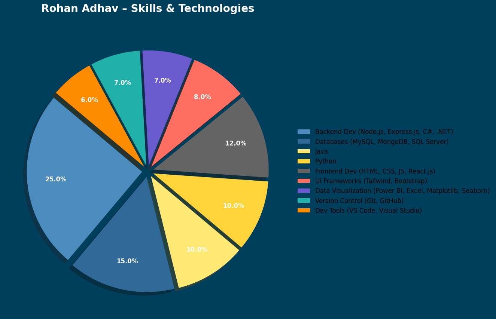

# Hi there 👋, I'm Rohan Adhav

I’m a **Computer Engineering graduate (CGPA: 8.35)** with a passion for building **full-stack applications, AI projects, and data-driven solutions**.  
Over the years, I’ve created projects ranging from **AI-powered apps**, **blockchain platforms**, **data dashboards**, to **interactive web apps**. I love crafting code that’s **clean, efficient, and solves real-world problems**.

📍 Based in Nashik, India | 🌎 Open to remote opportunities  
💡 Always learning, experimenting, and pushing the boundaries of technology

---

## 🛠 My Tech Toolbox

---

## 🚀 Projects Portfolio

**1. Flavorly AI**  
- **Live:** [flavorly-ai-rohan.vercel.app](https://flavorly-ai-rohan.vercel.app/)  
- **GitHub:** [Flavorly.AI](https://github.com/Rohan-Adhav/flavorly.AI.git)  
An **AI-powered recipe generator** that suggests meals based on available ingredients using the **Hugging Face API**.  
**Tech Stack:** React.js, Vite, Hugging Face API, HTML, CSS, JavaScript  
**Highlights:** Fast response, modern UI/UX, prompt engineering, AI integration.

---

**2. Meme Generator**  
- **Live:** [meme-generator-rohan.vercel.app](https://meme-generator-rohan.vercel.app/)  
- **GitHub:** [memeGenerator](https://github.com/Rohan-Adhav/memeGenerator.git)  
Generate and share memes instantly.  
**Tech Stack:** React.js, HTML, CSS, JavaScript  
**Highlights:** Interactive UI, meme download functionality, responsive design.

---

**3. Travel Journal**  
- **Live:** [travel-journal-rohan.vercel.app](https://travel-journal-rohan.vercel.app/)  
- **GitHub:** [Travel_journal](https://github.com/Rohan-Adhav/Travel_journal.git)  
A dynamic platform to **plan, document, and share travel experiences**, enhanced with **AI-generated memes** for fun storytelling.  
**Tech Stack:** React.js, HTML, CSS, JavaScript, Memes API  
**Highlights:** Interactive UI, AI integration, responsive design, travel memory curation.

---

**4. Tenzzies Game**  
- **Live:** [tenzzies-rohan.vercel.app](https://tenzzies-rohan.vercel.app/)  
- **GitHub:** [Tenzzies](https://github.com/Rohan-Adhav/Tenzzies.git)  
A fun **dice game** to practice React concepts and state management.  
**Tech Stack:** React.js, CSS3, JavaScript  
**Highlights:** Dynamic UI, game logic, interactive animations.

---

**5. Portfolio Website**  
- **Live:** [rohan-adhav-portfolio.vercel.app](https://rohan-adhav-portfolio.vercel.app/)  
- **GitHub:** [portfolio](https://github.com/Rohan-Adhav/portfolio.git)  
Personal portfolio showcasing projects, skills, and achievements.  
**Tech Stack:** React.js, Tailwind CSS  
**Highlights:** Clean, modern design, responsive layout, interactive sections.

---

**6. PDF Merger & Processor**  
- **Live:** [pdf-merger-gl7y.onrender.com](https://pdf-merger-gl7y.onrender.com/)  
- **GitHub:** [PDF_MERGER](https://github.com/Rohan-Adhav/PDF_MERGER)  
Automates **PDF merging, parsing, and conversion**.  
**Tech Stack:** Node.js, Express.js, HTML/CSS  
**Highlights:** File handling automation, multi-format support, easy-to-use interface.

---

**7. TO-DO List**  
- **Live:** [to-do-list-rohan.vercel.app](https://to-do-list-rohan.vercel.app/)  
- **GitHub:** [TO_DO_LIST](https://github.com/Rohan-Adhav/TO_DO_LIST.git)  
Simple **task management app** to stay organized.  
**Tech Stack:** React.js, JavaScript, CSS  
**Highlights:** Add/remove tasks, responsive design, minimalistic UI.

---

**8. Wedding Hall Booking**  
- **Live:** [to-do-list-rohan.vercel.app](https://to-do-list-rohan.vercel.app/)  
- **GitHub:** [wedding_hall](https://github.com/Rohan-Adhav/wedding_hall.git)  
Online booking platform for wedding venues.  
**Tech Stack:** React.js, Firebase  
**Highlights:** Booking system, real-time data sync, interactive interface.

---

**9. Frontend Projects Collection**  
- **GitHub:** [Frontend_projects](https://github.com/Rohan-Adhav/Frontend_projects.git)  
Collection of **small-to-medium frontend projects** demonstrating UI/UX skills.  
**Tech Stack:** React.js, HTML, CSS, JavaScript

---

**10. Python Projects**  
- **GitHub:** [python](https://github.com/Rohan-Adhav/python.git)  
Compilation of **Python scripts & automation projects**, showcasing problem-solving and algorithms.

---

**11. Data Analytics Projects**  
- **GitHub:** [Data_analytics_projects](https://github.com/Rohan-Adhav/Data_analytics_projects.git)  
Projects that **analyze, visualize, and interpret data** for actionable insights.  
**Tech Stack:** Power BI, Python, Excel

---

**12. Age & Gender Detection**  
- **GitHub:** [age-and-gender-detection](https://github.com/Rohan-Adhav/age-and-gender-detection.git)  
AI model to detect **age and gender from images**.  
**Tech Stack:** Python, OpenCV, Machine Learning

---

**13. Fine-Tuning Transformer for Sentiment Analysis**  
- **GitHub:** [Fine-Tuning-a-Pretrained-Transformer-for-sentiment-analysis](https://github.com/Rohan-Adhav/Fine-Tuning-a-Pretrained-Transformer-for-sentiment-analysis.git)  
Fine-tuned **pre-trained transformer** for sentiment classification.  
**Tech Stack:** Python, Hugging Face Transformers, NLP  
**Highlights:** AI/ML, deep learning, real-world text analysis.

---

**14. Java Projects**  
- **GitHub:** [java_projecs](https://github.com/Rohan-Adhav/java_projecs.git)  
Collection of **Java-based projects** covering OOP, data structures, and algorithms.  

---

## 📊 Skills Dashboard

Here’s a visual breakdown of my core technologies and expertise:

  

---

## 🌐 Connect with Me

---

<i>“I write code not just to build apps, but to create solutions that matter.”</i>

